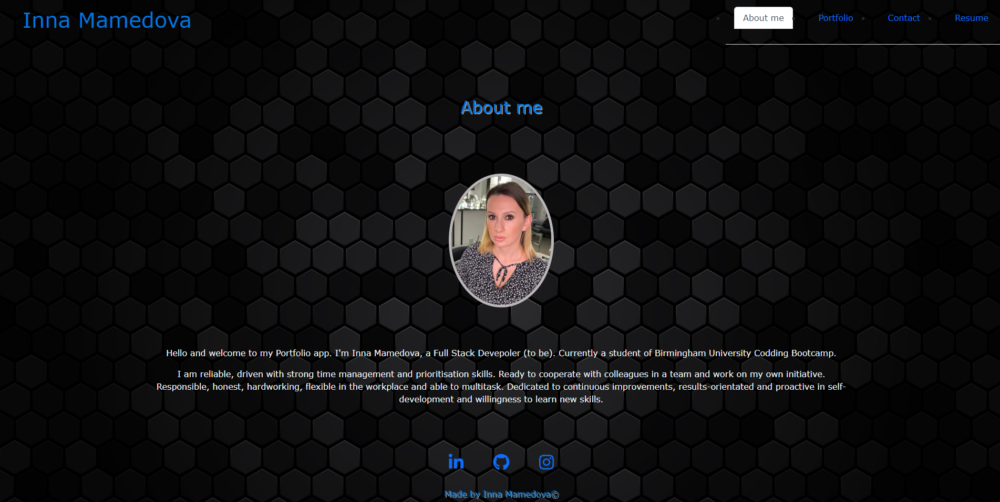

# Inna-Mamedova-React-Portfolio

## Project requirements
Create a portfolio using your React skills and deploy this application to GitHub Pages.

## Table of Contents

- [Project requirements](#project-requirements)
- [Description](#description)
- [Technology used](#technology-used)
- [Screenshot](#screenshot)
- [Deployed Link](#deployed_link)
- [Author](#author)

## Description
My name is Inna Mamedova and this is my portfolio created using React.js.
Being a web developer means being part of a community. We all need a place not only to share our projects while applying for jobs or working as a freelancer but also to share our work with other developers and collaborate on projects.

## Technology used
- React
- CSS
- VS code

## Screenshot

## Deployed Link
[Web page](https://inna1201.github.io/inna-portfolio)

## Author

Created by Inna Mamedova.
[GitHub](https://drive.google.com/file/d/1AneNYo5cXV_DvJggvvET7CkPKmIGJNvv/view)

